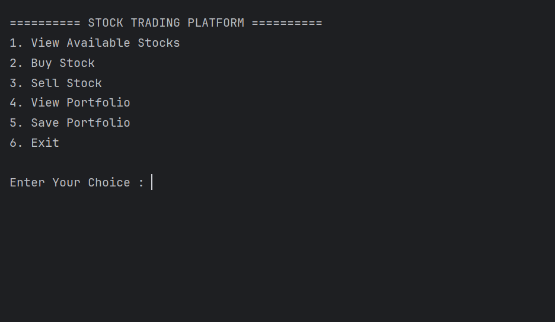
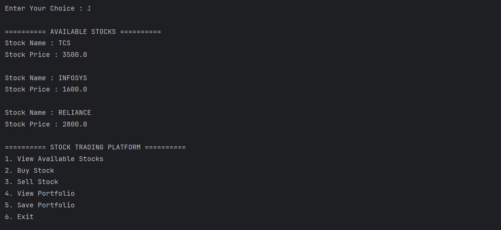
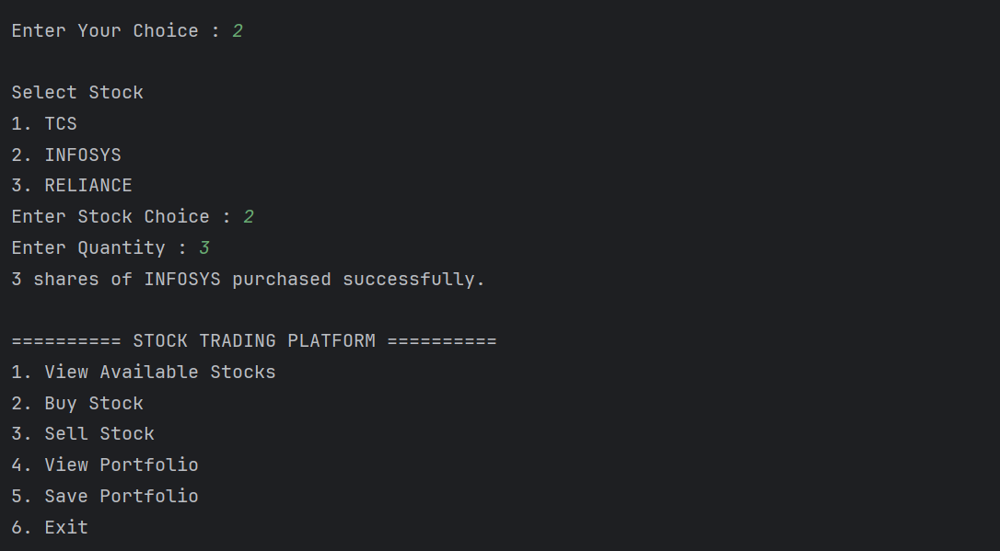
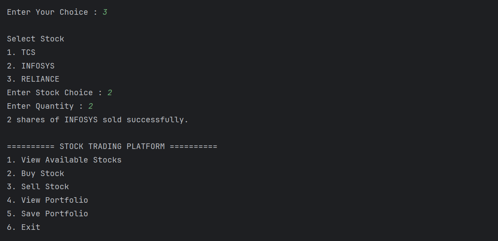
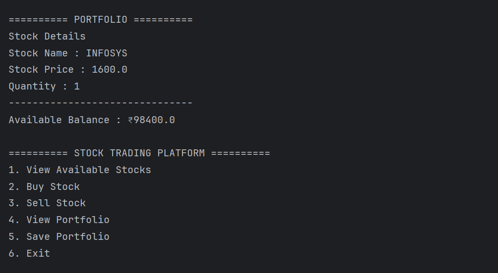
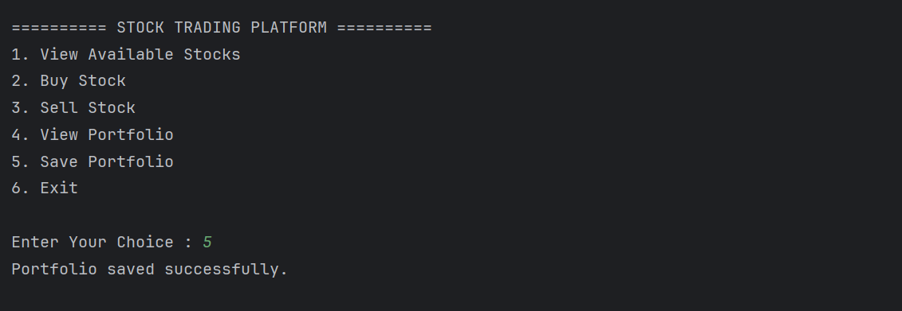

# Stock Trading Platform

This is a simple Java console-based Stock Trading Platform developed during my CodeAlpha Java Programming Internship.

The project allows a user to buy and sell stocks, view their portfolio, and save portfolio details into a text file. It helped me improve my understanding of Java OOP concepts, collections, file handling, and exception handling.

---

## Features

- View available stocks
- Buy stocks
- Sell stocks
- View portfolio
- Save portfolio to a text file
- Simple menu-driven console application

---

## Technologies Used

- Java
- IntelliJ IDEA
- OOP (Object-Oriented Programming)
- ArrayList
- File Handling
- Exception Handling
- Git & GitHub

---

## OOP Concepts Used

- Class and Object
- Constructor
- Encapsulation
- Getter and Setter
- Method Overriding
- HAS-A Relationship
- Static Methods

---

## Project Structure

```text
CodeAlpha_StockTradingPlatform
│
├── src
│   └── com
│       └── yuvraj
│           └── stocktrading
│               ├── Main.java
│               ├── Stock.java
│               ├── PortfolioItem.java
│               ├── Transaction.java
│               ├── User.java
│               └── FileManager.java
│
├── data
│   └── portfolio.txt
│
├── Screenshots
│
└── README.md
```

---

## How to Run

1. Clone this repository.
2. Open the project in IntelliJ IDEA.
3. Run the `Main.java` file.
4. Choose options from the menu.
5. Buy or sell stocks.
6. View portfolio.
7. Save portfolio before exiting.

---

## Screenshots

### Home Menu



---

### Available Stocks



---

### Buy Stock



---

### Sell Stock



---

### Portfolio



---

### Save Portfolio


---

## Future Improvements

- Load portfolio from file
- Transaction history
- Profit/Loss calculation
- Search stock by name
- Database integration
- Java Swing GUI version

---

## Author

**Yuvraj Mandloi**

Developed as part of the **CodeAlpha Java Programming Internship**.

---

⭐ Thank you for visiting this repository.
